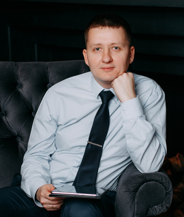

# Yuriy Biakov

## Contacts
 
- St. Petersburg, Russia
- gbyackov@gmail.com
- +7 900 625 05 55
- discord: Yuriy Biakov (@YuriyBiakov) 

## About Me

I am a lawyer from St. Petersburg.
My specialty is corporate bankruptcy. I like my job, but I want something new.

**My goal:** to learn a new modern profession that will allow me to work with modern technologies, the latest approaches to project management and gain experience of living and working in other countries.

In my new field, I would like to work in a friendly positive environment, surrounded by people who are passionate about their work.

As a lawyer, I have logical thinking, skills in working with large volumes of documentation, teamwork, and public speaking.

I am a confident computer user, interested in information technology.

## Skills

- Java Basics (JavaRush 32lvl)
- Git Basics
- Markdown Basics
- VS Code, IntelliJ IDEA

## Code Example

```
while (alive) {
    experience++;
}
```

## Experience

[Training task **CV#1. Markdown & Git** (RS School “JavaScript/Front-End Stage 0”)](https://yuriybiakov.github.io/rsschool-cv/cv)


## Education

- St. Petersburg Marine Technical University

    -  2003 - 2008 
    - Lawyer - Master degree  


## Language Skills

- English: Pre-Intermediate (A2+)
